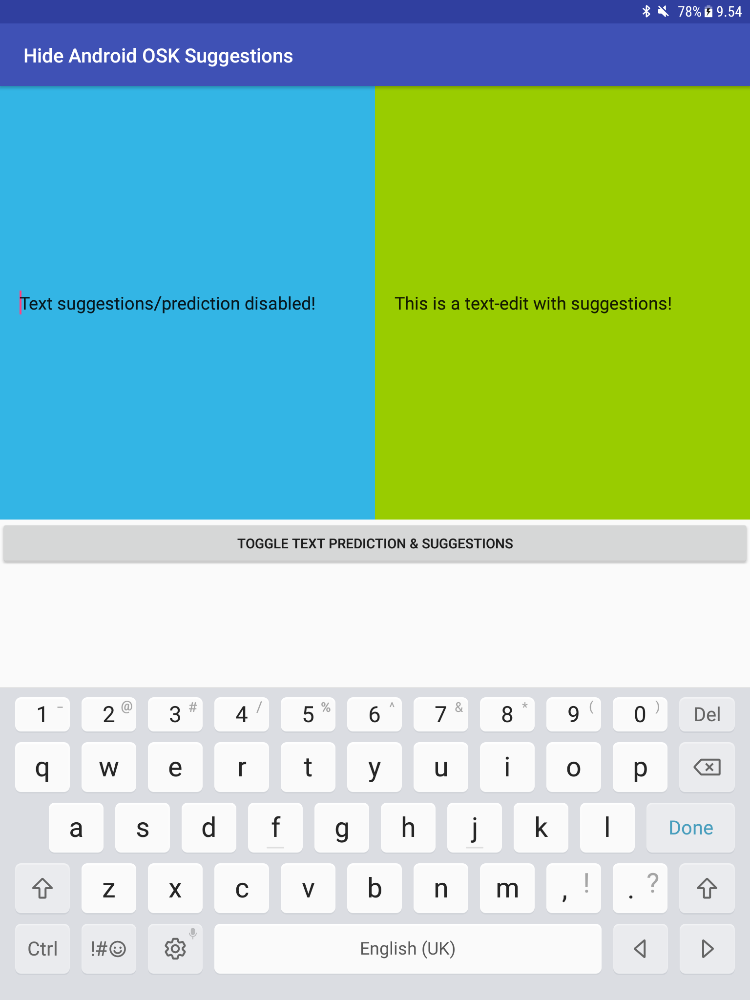

Hide Suggestions on Android OSK from C++/JNI
==================
This a sample Androd project which demonstrates how to hide on screen keyboard from an existing TextField from the native C++ via JNI call to Java.

This sample uses the new [Android Studio CMake plugin](http://tools.android.com/tech-docs/external-c-builds) with C++ support.

Pre-requisites
--------------
- Android Studio 2.2+ with [NDK](https://developer.android.com/ndk/) bundle.

Getting Started
---------------
1. [Download Android Studio](http://developer.android.com/sdk/index.html)
1. Launch Android Studio.
1. Open the sample directory.
1. Open *File/Project Structure...*
  - Click *Download* or *Select NDK location*.
1. Click *Tools/Android/Sync Project with Gradle Files*.
1. Click *Run/Run 'app'*.

Screenshots
-----------

Support
-------
If you've found an error in these samples, please [file an issue](https://github.com/laurikortevaara/android-osk-hide-suggestions/issues/new).

Patches are encouraged, and may be submitted by [forking this project](https://github.com/laurikortevaara/android-osk-hide-suggestions/fork) and
submitting a pull request through GitHub.

License
-------
This project uses a Do-What-Ever license
